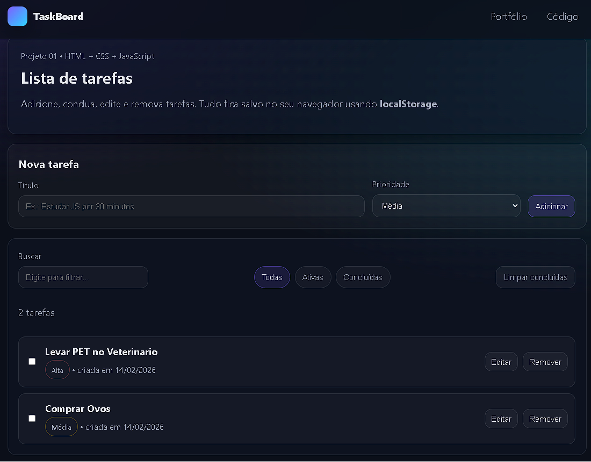

# 🗂️ TaskBoard

Aplicação web de lista de tarefas desenvolvida com **HTML, CSS e JavaScript puro**, permitindo criar, editar, concluir e remover tarefas.

Os dados ficam armazenados no navegador usando **localStorage**, garantindo que as tarefas permaneçam salvas mesmo após recarregar a página.

---

## 🚀 Acesse o projeto online

https://djosh193.github.io/projects/taskboard/

---

## 📸 Preview do sistema



---

## 🧠 Funcionalidades

- ✅ Criar nova tarefa
- ✅ Definir prioridade
- ✅ Editar tarefa
- ✅ Remover tarefa
- ✅ Marcar como concluída
- ✅ Filtrar tarefas (todas / ativas / concluídas)
- ✅ Buscar tarefas por texto
- ✅ Persistência automática com localStorage

---

## 🛠️ Tecnologias utilizadas

- HTML5
- CSS3
- JavaScript (Vanilla JS)
- Web Storage API

---

## 📚 Conceitos praticados

- Manipulação do DOM
- Eventos de formulário
- Arrays e objetos em JavaScript
- Persistência de dados no navegador
- Organização de interface
- Estruturação de projeto front-end

---

## 📂 Estrutura do projeto

```
taskboard/
│── index.html
│── styles.css
│── script.js
│── assets/
```

---

## ▶️ Como executar localmente

Clone o repositório:

```
git clone https://github.com/djosh193/NOME-DO-REPO.git
```

Abra o arquivo:

```
index.html
```

---

## 🎯 Sobre o projeto

Este projeto faz parte do meu processo de aprendizagem em desenvolvimento front-end e construção do meu portfólio profissional.

---

## 👨‍💻 Autor

**Jorge Simões**

GitHub: https://github.com/djosh193
LinkedIn: https://www.linkedin.com/in/jsaj/
Email: [jorge10_saj@hotmail.com](mailto:jorge10_saj@hotmail.com)
